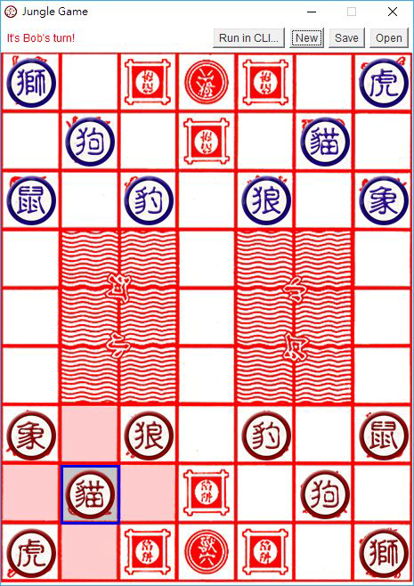
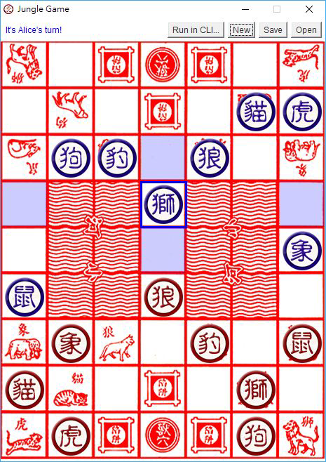
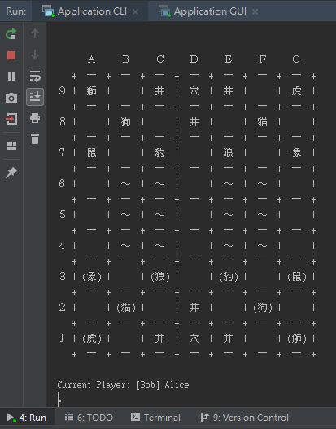

# comp-jungle
This project was created in 2018 as a part of the assignment for a java programming course. 
The project features a Java Implementation of the classic Chinese board game [Jungle](https://en.wikipedia.org/wiki/Jungle_(board_game)) 
with both a command and graphical user interface.  

## Launching the game
Launch the built `.jar` artifact directly launches the game in normal mode. Allowing 
the players to start the game. Clicking on the pieces will highlight the tiles a piece 
is allowed to move. Clicking on the highlighted tile moves the piece.  
   

## Launching in CLI mode
Launching the `.jar` artifact with `--cli` argument allows the game to be played in a 
command line environemnt. 
  
The game supports the following commands:
- `NEW` creates a new game
- `OPEN "<filename>"` opens an exisitng game
- `SAVE "<filename>"` saves a game
- `MOVE <from[A1..G9]> <to[A1..G9]>` moves a piece
- `EXIT` exits the game

## Other Features
- Save and load states at anytime
- Warnings for unsaved games
- Warnings for invalid moves and commands
